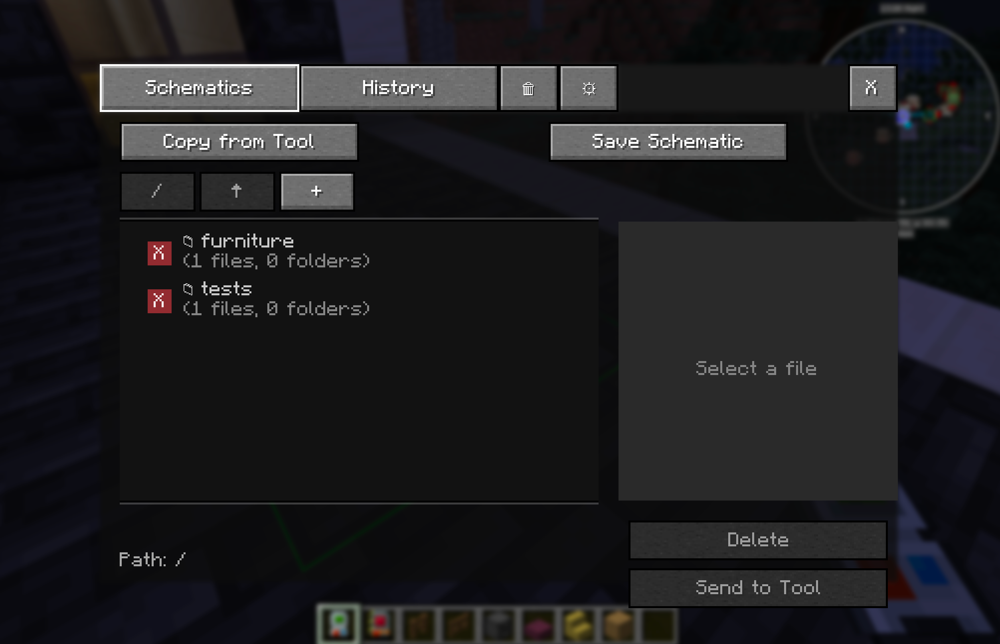
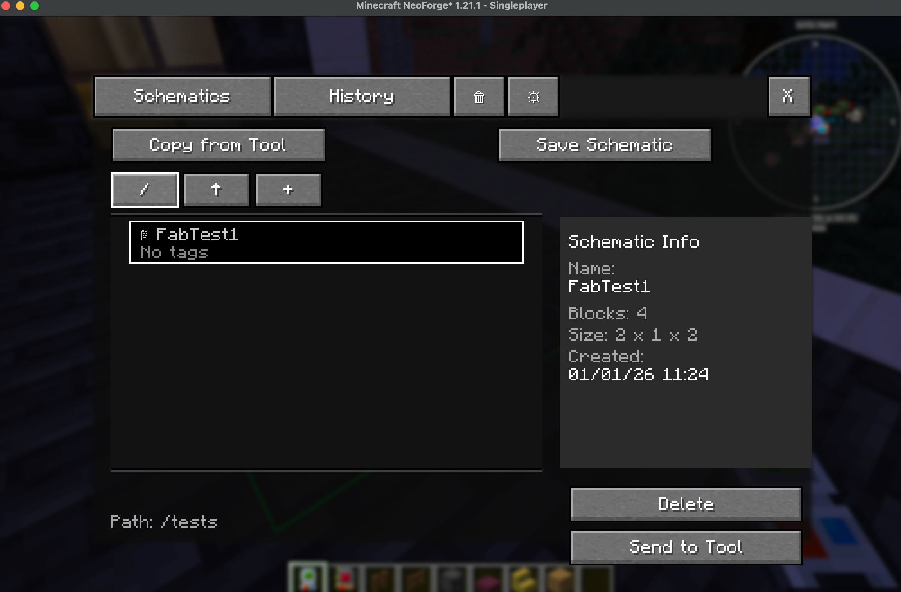
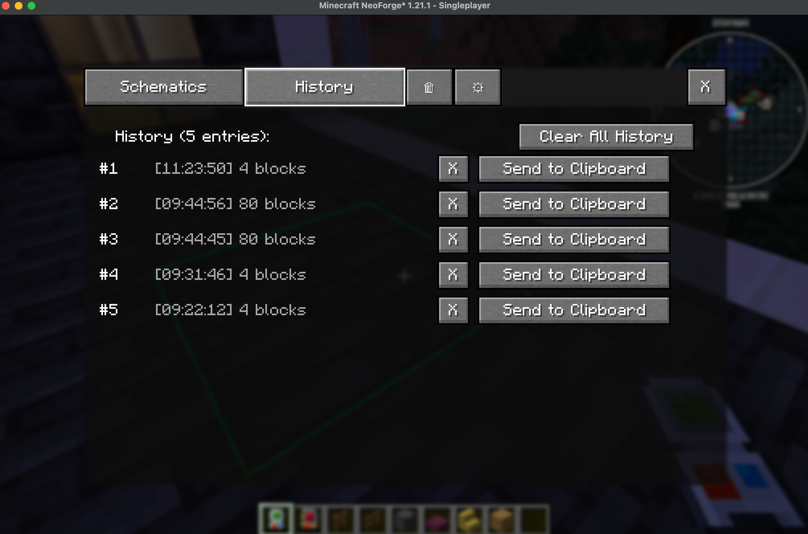

# BuildingGadgets2 GUI Mod

## Description
This is a Minecraft NeoForge mod that enhances the Building Gadgets 2 (BG2) mod by adding a GUI interface for managing schematics. It allows players to save, load, and organize templates (schematics) to disk, making them reusable across different Minecraft worlds.

> NB: You need to have Bg2 installed, this mod does not replace Bg2!

## Key Features
- GUI interface for BG2 copy/paste tool
- Schematic save/load functionality
- File organization with folders
- History tracking of operations
- Trash/recycle bin for deleted schematics
- Keyboard shortcuts
- Cross-world schematic reusability

# Screenshots

## Technology Stack
- **Minecraft Version:** 1.21.1
- **NeoForge Version:** 21.1.217
- **Java Version:** 21
- **Build Tool:** Gradle
- **Dependencies:** Building Gadgets 2 (v1.3.9)

# Contact

Please send feedback, ideas, to fernandobe+mc@protonmail.com
if you have github open issues here, if not also use email.
